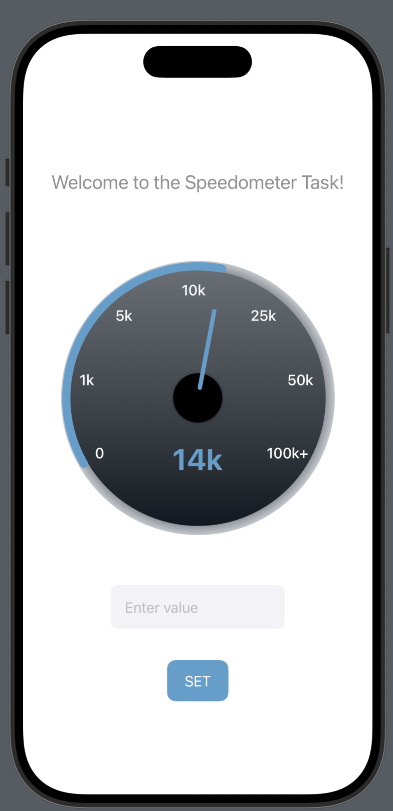

# 🚀 Speedometer SwiftUI App

A simple yet elegant **iOS application** built with **SwiftUI** that demonstrates a custom, interactive **speedometer component**.  
Users can input a value, and the speedometer's **needle & progress arc animate smoothly** to reflect the new reading.

  

---

## ✨ Features
- 🏎️ **Interactive Dial** – custom-built, visually appealing speedometer  
- 🎞️ **Smooth Animations** – needle, arc, and value update with ease-in-out transitions  
- ⌨️ **User Input** – text field & button to set custom values  
- 🛡️ **Input Validation** – handles invalid entries gracefully  
- 📐 **Dynamic Mapping** – values mapped to dial angle using interpolation  
- 📳 **Haptic Feedback** – tactile response when updating value  
- ♻️ **Modular Code** – reusable SwiftUI views for better maintainability  

